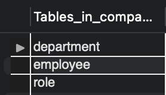
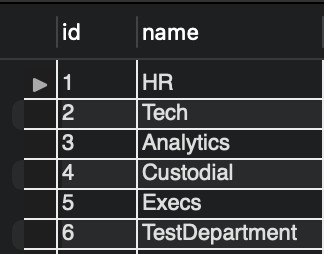
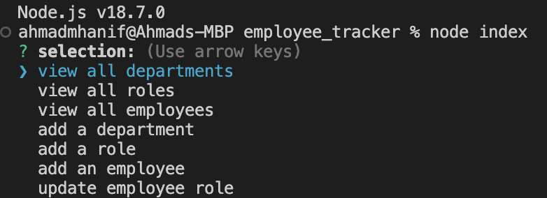

# employee_tracker

Youtube walkthrough link: https://youtu.be/_D1dugi0MkA

## Requirements
Inqueirer: Inqureier package is required to pull in user input in the terminal

mySQL2: mySQL is required as the database technology to create, update and delete data

## Screenshots

Schema in sql workbench

Department Demo

Node Application Demo

